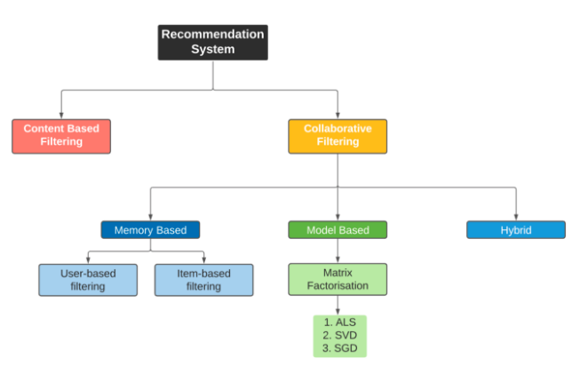

## Recommendation System Overview:

## Dataset:
[MovieLens](https://grouplens.org/datasets/movielens/)
Last updated 9/2018

+ Integrated three data sources that contain 100,000 ratings of 9,000 movies by 600 users
+ Performed data preprocessing using Spark DataFrame
+ Calculated the sparsity of the original matrix
+ Created train/test splits and created ALS model
+ Built a cross validation pipeline to tune the hyperparameters
+ Evaluated the performance using RMSE on test set
